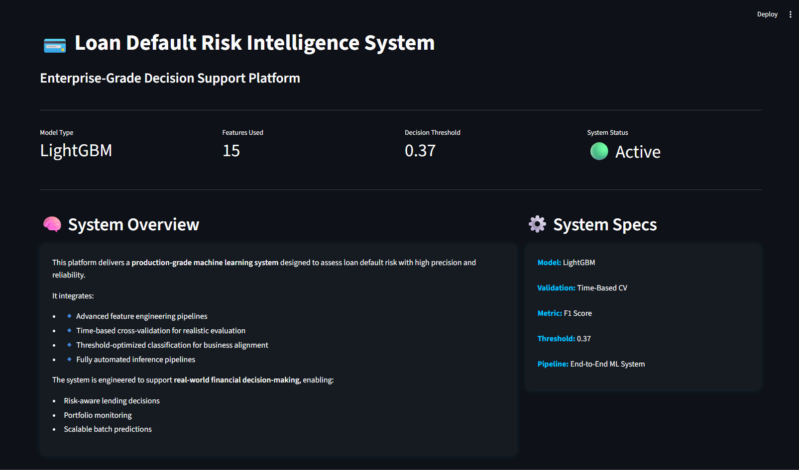
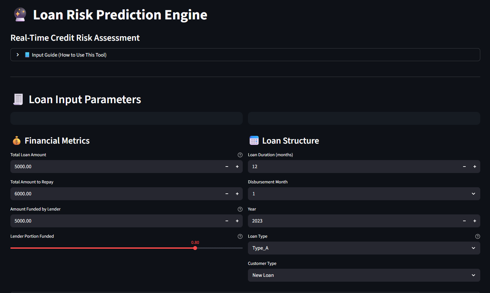
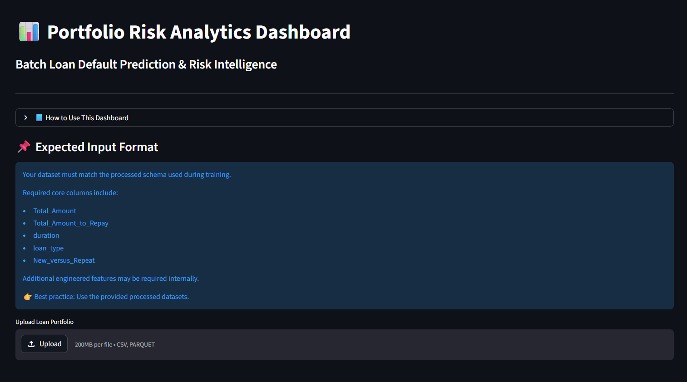
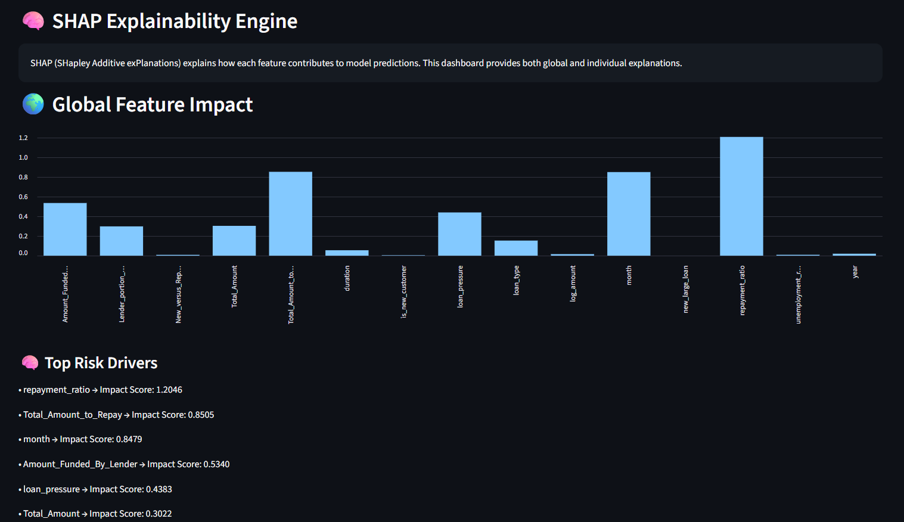

# 💳 Loan Risk Intelligence System


> 🚀 **Production-grade machine learning platform for real-time and batch loan default prediction, featuring explainable AI, portfolio analytics, and scalable deployment.**

---

## 🌐 Live Application

🔗 **Streamlit App:**  
https://loan-default-risk-app.streamlit.app/

🔗 **GitHub Repository:**  
https://github.com/theerealhenry/Loan-Default-Prediction-Project

---

## 🎥 System Preview

### 🏠 Main Dashboard


### 🔮 Single Loan Prediction


### 📊 Portfolio Analytics


### 🧠 Model Explainability (SHAP)


---

## 🎯 Problem Context

Financial institutions must accurately assess **loan default risk** to minimize losses and optimize lending decisions.

This challenge becomes significantly more complex in **emerging markets**, where:

- Customer behavior is heterogeneous  
- Economic conditions are dynamic  
- Data distributions vary across regions  

This system is inspired by real-world financial data from the **AI4EAC Finance Challenge (Zindi)** and is designed to:

✔ Generalize across markets (Kenya & Ghana)  
✔ Handle class imbalance and noisy features  
✔ Provide **interpretable, production-ready predictions**

---

## 💡 Solution Overview

The **Loan Risk Intelligence System** is an end-to-end machine learning platform that enables:

- 🔮 **Real-time loan risk prediction**
- 📊 **Batch portfolio risk analytics**
- 🧠 **Explainable AI (SHAP-based insights)**
- 🎯 **Risk segmentation & decision support**

The system is designed to replicate a **real-world fintech credit scoring engine**, combining predictive accuracy with transparency and usability.

---

## 🏗️ System Architecture

Raw Data → Feature Engineering → Model (LightGBM) → Inference Layer → Risk Segmentation → Streamlit UI (Real-Time + Batch + SHAP)


### Key Design Principles:
- Modular pipeline (separation of concerns)
- Config-driven architecture (YAML)
- Reproducible training & inference
- Production-ready deployment

---

## ⚙️ Key Features

### 🔮 Prediction Engine
- Single-loan real-time prediction
- Batch portfolio scoring
- Probability-based classification

### 📊 Analytics Dashboard
- Portfolio-level KPIs
- Risk distribution visualization
- Segment-level breakdown (Low / Medium / High)

### 🧠 Explainability Engine
- Global feature importance (SHAP)
- Per-loan contribution analysis
- Transparent decision reasoning

### 🎯 Decision Support System
- Risk categorization
- Actionable recommendations
- Threshold-optimized predictions

---

## 🤖 Machine Learning Pipeline

### 📦 Data Processing
- Data cleaning & validation
- Handling missing values
- Removal of leakage-prone variables

### 🧠 Feature Engineering
- Financial ratios (repayment_ratio, loan_pressure)
- Behavioral indicators (new vs repeat)
- Interaction features (new_large_loan)
- Temporal features (month, year)

### ⚡ Model
- **LightGBM Classifier**
- Optimized for tabular financial data

### 🔁 Validation Strategy
- Time-based cross-validation
- Prevents temporal leakage
- Simulates real-world deployment

### 🎯 Optimization
- Threshold tuning for F1 maximization
- Class imbalance handling (`scale_pos_weight`)

---

## 📊 Model Performance

| Metric | Value |
|------|------|
| Features | 17 |
| Best Threshold | 0.12 |
| OOF F1 Score | **0.7254** |
| CV Mean F1 | **0.8387** |

### Key Insights:
- High-quality feature selection outperformed complex ensembles  
- Financial + behavioral features dominate predictive power  
- Threshold tuning significantly improves real-world performance  
- Model demonstrates strong generalization across markets  

---

## 🧠 Explainability (SHAP)

To ensure transparency in risk-sensitive decisions, the system integrates **SHAP (SHapley Additive Explanations)**:

- 🌍 Global feature importance  
- 🔍 Individual prediction breakdown  
- 📌 Feature-level contribution analysis  

This enables:
- Regulatory compliance  
- Stakeholder trust  
- Model debugging & validation  

---

## 🚀 Deployment

### 🟢 Streamlit Cloud
- Public, interactive application  
- Instant access for stakeholders  

### 🐳 Dockerized Deployment

```bash
# Build image
docker build -t loan-default-risk-app .

# Run container
docker run -p 8501:8501 loan-default-risk-app
```
**Key Benefits:**

+ Environment consistency
+ Easy scalability
+ Production-ready packaging

---
## 📂 Project Structure

streamlit_app/     → UI (Streamlit frontend)
src/               → ML pipeline (features, modeling, preprocessing)
models/            → Trained models & artifacts
configs/           → YAML configuration files
data/              → Raw & processed datasets
notebooks/         → Experimentation & research

---

## 🛠️ Tech Stack

+ Python
+ LightGBM
+ SHAP
+ Streamlit
+ Pandas / NumPy
+ Docker
+ YAML Configs

---
## 🧪 Run Locally

```bash
git clone https://github.com/theerealhenry/Loan-Default-Prediction-Project
cd Loan-Default-Prediction-Project

pip install -r requirements.txt

streamlit run streamlit_app/app.py
```
---
## 📌 Future Improvements

+ 🌐 API deployment (FastAPI)
+ ☁️ Cloud infrastructure (AWS / GCP)
+ 🔄 Automated retraining pipelines
+ 📡 Real-time data streaming
+ 🧠 Advanced ensemble models

---
## 👤 Author

Henry Otsyula
Data Scientist | Machine Learning Engineer

🔗 LinkedIn:
https://www.linkedin.com/in/henry-otsyula-datascientist

🌐 Portfolio:
https://www.datascienceportfol.io/otsyulahenry

---

## 📜 License

This project is licensed under the MIT License.

---
## 🚀 Final Note

This project demonstrates the design and deployment of a production-grade machine learning system that combines:

+ Predictive modeling
+ Explainable AI
+ Scalable architecture
+ Business-oriented decision support

It reflects a strong focus on real-world applicability, robustness, and engineering excellence in financial risk modeling.